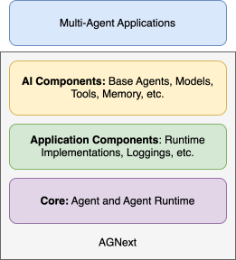

# API 层

API 由以下层组成：

- {py:mod}`autogen_core.base`
- {py:mod}`autogen_core.application`
- {py:mod}`autogen_core.components`

下图显示了各层之间的关系。

{py:mod}`autogen_core.base` 层定义了代理、消息和运行时的核心接口和基类。这一层是框架的基础，被其他层使用。

{py:mod}`autogen_core.application` 层提供了运行时的具体实现和用于构建多代理应用程序的实用工具，如日志记录。

{py:mod}`autogen_core.components` 层提供了用于构建 AI 代理的可重用组件，包括类型路由代理、AI 模型客户端、AI 模型工具、代码执行沙箱和内存存储。

这些层之间松散耦合，可以独立使用。例如，您可以用自己的运行时实现替换 {py:mod}`autogen_core.application` 层中的运行时。您也可以跳过 {py:mod}`autogen_core.components` 层中的组件，构建自己的组件。